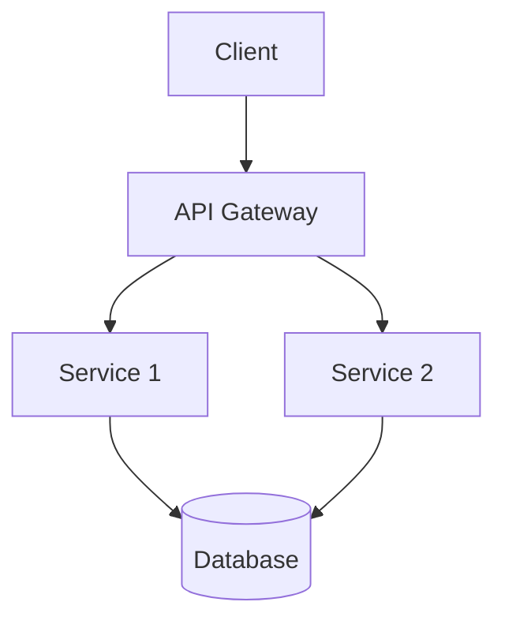

# md2slides

> Universal Markdown to Slides Converter — Transform any Markdown file into beautiful interactive presentations with Mermaid diagrams, PDF export, and custom themes.

[](https://github.com/user/md2slides/actions/workflows/ci.yml)
[](https://opensource.org/licenses/MIT)
[](https://nodejs.org/)
[](https://www.typescriptlang.org/)

## Features

- **Markdown-based authoring** — Write slides in Markdown, separated by `---`
- **6 built-in themes** — Default, Light, Solarized, Midnight, Minimal, Corporate
- **Mermaid diagrams** — Render flowcharts, sequence diagrams, and more inline
- **PDF export** — Export presentations to PDF with a single command
- **Live preview server** — Hot-reload dev server with WebSocket sync
- **Speaker notes** — Add notes with `<!-- notes: ... -->` comments
- **Two-column layouts** — Split content with `|||` separator
- **Code highlighting** — Syntax highlighting for 190+ languages
- **Frontmatter config** — Configure title, author, theme, transitions, and more
- **CLI tool** — Full-featured CLI with init, convert, serve, and themes commands
- **Docker support** — Run in a container with zero local dependencies

## Quick Start

### Installation

```bash
npm install -g md2slides
```

### Create a presentation

```bash
md2slides init my-talk
```

### Preview with live reload

```bash
md2slides serve my-talk.md
```

### Export to HTML

```bash
md2slides convert my-talk.md -o presentation.html
```

### Export to PDF

```bash
md2slides convert my-talk.md -f pdf -o presentation.pdf
```

## Markdown Syntax

### Basic slide

```markdown
# Slide Title

Content goes here
```

### Multiple slides

Separate slides with `---`:

```markdown
# First Slide

Content

---

# Second Slide

More content
```

### Frontmatter configuration

```markdown
---
title: My Presentation
author: Jane Doe
theme: midnight
transition: fade
width: 1920
height: 1080
---

# Welcome
```

### Speaker notes

```markdown
# Important Slide

Key content

<!-- notes: Don't forget to mention the Q3 numbers -->
```

### Two-column layout

```markdown
## Comparison

Left column content

|||

Right column content
```

### Mermaid diagrams

````markdown
## Architecture


````

### Slide-level configuration

```markdown
<!-- slide: transition: fade bg: #1a1a2e -->
# Custom Styled Slide
```

## Themes

| Theme       | Description                              |
| ----------- | ---------------------------------------- |
| default     | Clean dark theme with white text         |
| light       | Bright theme with dark text on white     |
| solarized   | Solarized color scheme — warm and readable |
| midnight    | Deep midnight blue with soft accents     |
| minimal     | Minimalist — clean and distraction-free  |
| corporate   | Professional serif typography            |

List available themes:

```bash
md2slides themes
```

## CLI Reference

```
md2slides <command> [options]

Commands:
  convert <input>  Convert a Markdown file to a presentation
  serve <input>    Start a dev server with live preview
  themes           List available themes
  init [name]      Create a new presentation from a template

Options:
  -o, --output <path>      Output file path
  -t, --theme <name>       Theme name
  -f, --format <format>    Output format: html or pdf
  --title <title>          Presentation title
  --author <author>        Author name
  --transition <name>      Slide transition effect
  --width <pixels>         Slide width (default: 1280)
  --height <pixels>        Slide height (default: 720)
  -p, --port <port>        Dev server port (default: 3000)
  --no-watch               Disable file watching
```

## Docker

```bash
# Build
docker-compose build

# Run dev server
docker-compose up

# Convert to PDF
docker-compose run --rm md2slides convert /presentations/slides.md -f pdf -o /presentations/output.pdf
```

## Development

```bash
# Install dependencies
npm install

# Run tests
npm test

# Watch tests
npm run test:watch

# Lint
npm run lint

# Format
npm run format

# Build
npm run build
```

## Project Structure

```
md2slides/
├── src/
│   ├── cli.ts          # CLI entry point (commander)
│   ├── parser.ts       # Markdown → Slide objects
│   ├── converter.ts    # Slide objects → Reveal.js HTML
│   ├── themes.ts       # Theme definitions
│   ├── exporter.ts     # PDF/HTML export (puppeteer)
│   ├── server.ts       # Dev server with WebSocket hot reload
│   ├── types.ts        # TypeScript interfaces
│   └── web/            # Web assets for dev server
├── tests/
│   ├── parser.test.ts
│   ├── converter.test.ts
│   └── fixtures/
├── Dockerfile
├── docker-compose.yml
├── .github/workflows/
│   └── ci.yml
├── package.json
├── tsconfig.json
└── vite.config.ts
```

## License

MIT
