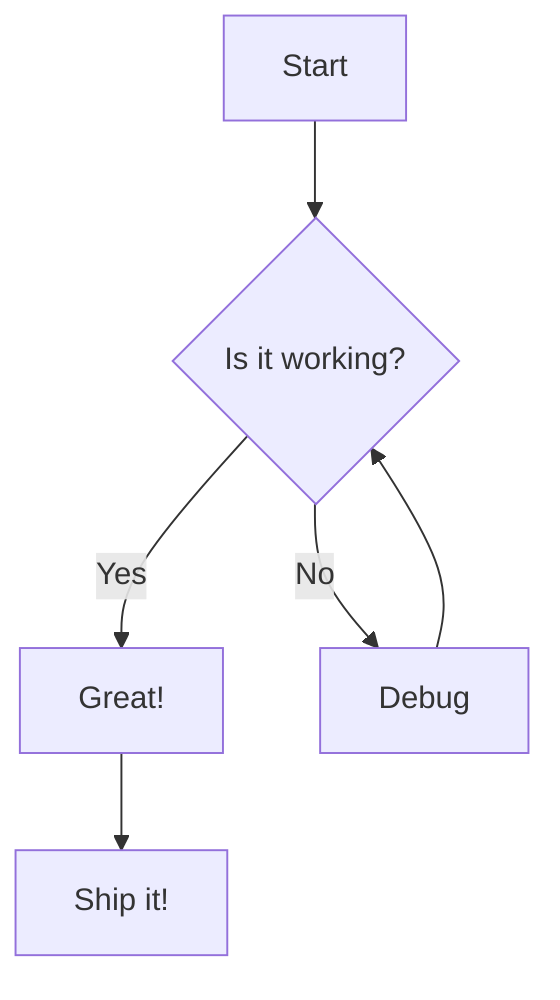

# Welcome to md2slides

A Universal Markdown to Slides Converter

<!-- notes: Welcome the audience and introduce the topic -->

---

## Key Features

- Markdown-based authoring
- Mermaid diagram support
- PDF export capability
- Live preview with hot reload
- 6 built-in themes
- Speaker notes support
- Two-column layouts
- Code syntax highlighting

---

## Two-Column Layout

### Left Column

- First point
- Second point
- Third point

|||

### Right Column

- Counter point
- Another idea
- Final thought

---

## Code Highlighting

```python
def fibonacci(n):
    if n <= 1:
        return n
    return fibonacci(n - 1) + fibonacci(n - 2)

print(fibonacci(10))
```

---

## Mermaid Diagrams



---

## Quotes

> "Simplicity is the ultimate sophistication."
> — Leonardo da Vinci

<!-- notes: This quote sets the tone for our design philosophy -->

---

## Section Break

---

## Configuration

You can configure your presentation with frontmatter:

```yaml
---
title: My Talk
author: Jane Doe
theme: midnight
transition: fade
width: 1920
height: 1080
---
```

---

## Thank You!

Questions?

Find us on GitHub
